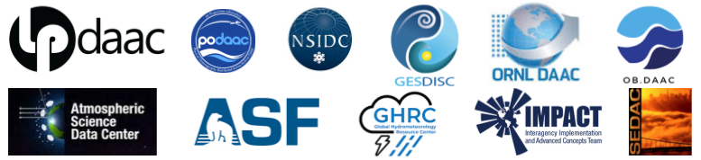

# Welcome

`earthaccess` is a python library to **search for**, and **download** or **stream** NASA Earth science data with just a few lines of code.

# Community Resources

Earthaccess is a highly active, open-source, and community-driven library whose development is being led through NASA Openscapes, an initiative to support researchers using data distributed by NASA Distributed Active Archive Centers (DAACs) as they migrate workflows to the cloud. Development of the earthaccess library also features leadership and contributions from private industry and the broader user community.

- [earthaccess Blog](https://www.earthdata.nasa.gov/news/blogearthaccess-earth-science-data-simplified)

- [earthaccess: Accelerating NASA Earthdata access through open, collaborative development](https://docs.google.com/presentation/d/1K5RbQj4OKWt49kznIF9ct-cmWADlvdYA0eI7dA7_fFg/edit#slide=id.g269ad4ab477_0_691) - Luis López, Matt Fisher, Aaron Friesz, Qiusheng Wu, Amy Steiker, earthaccess community. Feb 26, 2024. NASA ESDS Tech Spotlight. ([video](https://www.youtube.com/watch?v=EIr3j1_wDc0))

- [The earthaccess Python Library: Awesome Discovery and Access of NASA Earthdata](https://docs.google.com/presentation/d/e/2PACX-1vT8BN1C4FkHrid_eVfOwJjZzKGn9Nomb6mnDj3Nld-nD0ekzoenxQIq6Xzo9VFQsXbixCNskadBwPwM/pub?start=false&loop=false&delayms=3000) - Amy Steiker, Andrew P. Barrett, Charles Daniels, Matthew Fisher, Daniel Kaufman, Joseph H. Kennedy, Luis López, Julia S. Stewart Lowndes, Jessica Scheick, The NASA Openscapes mentors team. December 9, 2024. AGU Fall Conference Poster ([slide](https://docs.google.com/presentation/d/1iBqeMQcdNAxQfhIH9jdcvI2m1HmBxJFixLX1BnwG-S8/edit#slide=id.g317ff1cef8c_1_87))

# About

>*"earthaccess revolutionizes data access by drastically reducing the complexity and code required. Since open science is a collaborative effort involving people from different technical backgrounds, our team took the approach that data analysis can and should be made more inclusive and accessible by reducing the complexities of underlying systems."*
>
>Luis López, an NSIDC software developer and earthaccess creator

The library is an open source community effort under an [MIT license](LICENSE.txt).  We welcome contributions to improve `earthaccess`.  Please see the [Contributing Guide](contributing/index.md) to learn how to get involved.

***earthaccess*** handles authentication with [NASA's Earthdata Login (EDL)](https://urs.earthdata.nasa.gov), search using NASA's [CMR](https://cmr.earthdata.nasa.gov/search/site/docs/search/api.html) and access through [`fsspec`](https://github.com/fsspec/filesystem_spec).

# Supported By

