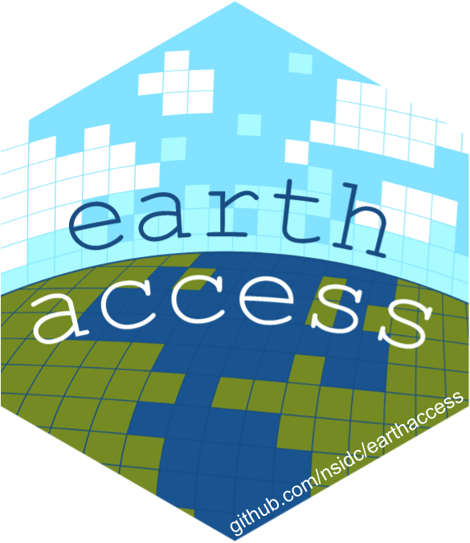

# What is `earthaccess`?

{alt="hexagonal artwork of a pixalated earth with the word earthaccess" width="20%"}

{alt="3-panel watercolor artwork of environmental data within mountains and streams with arrows labeled 'import' and 'earthaccess' that connect to a data analysis panel and then a communicate panel" width="100%"}

Learn more about `earthaccess`! [poster](https://docs.google.com/presentation/d/e/2PACX-1vT8BN1C4FkHrid_eVfOwJjZzKGn9Nomb6mnDj3Nld-nD0ekzoenxQIq6Xzo9VFQsXbixCNskadBwPwM/pub#slide=id.g317ff1cef8c_1_87) at 2024 AGU, [slides](https://docs.google.com/presentation/d/1K5RbQj4OKWt49kznIF9ct-cmWADlvdYA0eI7dA7_fFg/edit#slide=id.g269ad4ab477_0_691) and [video](https://www.youtube.com/watch?v=EIr3j1_wDc0) from 2024 NASA tech spotlight.

`earthaccess` is a python library to **search for**, and **download** or **stream** NASA Earth science data with just a few lines of code.

Open science only reaches its full potential if we have easy-to-use workflows that facilitate research in an inclusive, efficient and reproducible way. Unfortunately —as it stands today— scientists and students alike face a steep learning curve adapting to systems that have grown too complex and end up spending more time on the technicalities of the tools, cloud and NASA APIs than focusing on their important science.

During several workshops organized by [NASA Openscapes](https://nasa-openscapes.github.io/events.html), the need to provide easy-to-use tools to our users became evident. Open science is a collaborative effort; it involves people from different technical backgrounds, and the data analysis to solve the pressing problems we face cannot be limited by the complexity of the underlying systems. Therefore, providing easy access to NASA Earthdata regardless of the data storage location (hosted within or outside of the cloud) is the main motivation behind this Python library.

The library is an open source community effort under an [MIT license](LICENSE.txt). We welcome contributions to improve `earthaccess`. Please see the [Contributing Guide](contributing/index.md) to learn how to get involved.

***earthaccess*** handles authentication with [NASA's Earthdata Login (EDL)](https://urs.earthdata.nasa.gov), search using NASA's [CMR](https://cmr.earthdata.nasa.gov/search/site/docs/search/api.html) and access through [`fsspec`](https://github.com/fsspec/filesystem_spec).
