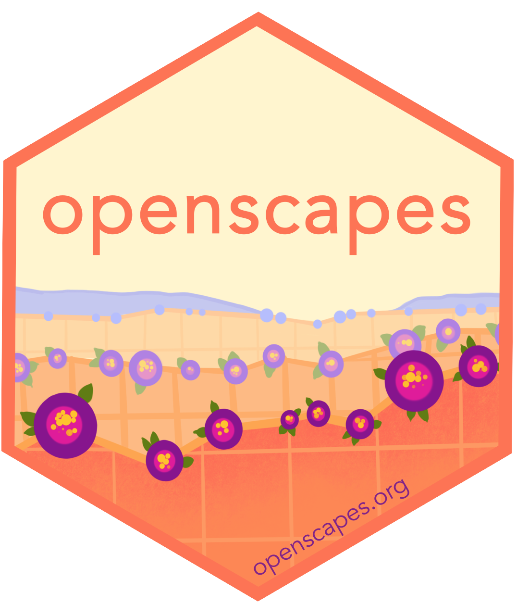
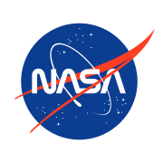
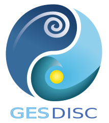
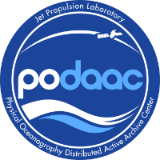
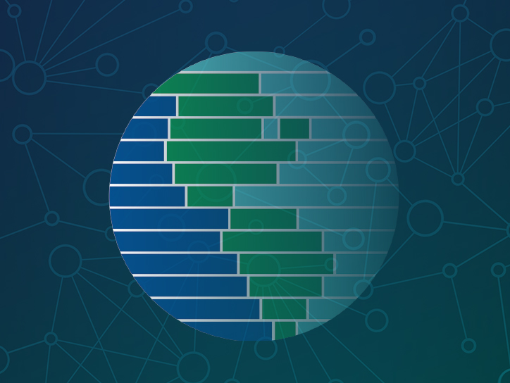
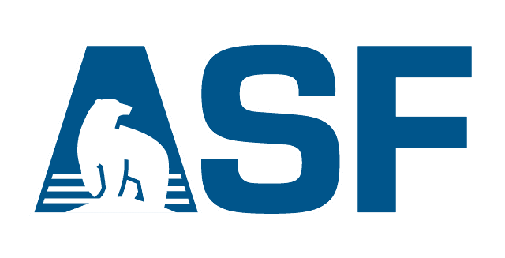
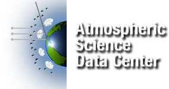
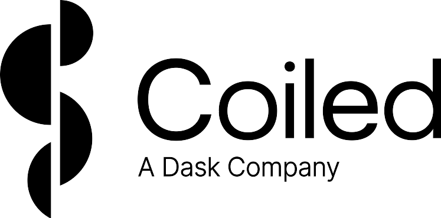

# Welcome to `earthaccess`!

`earthaccess` is a Python library to **search for** and **download** or **stream** NASA Earth science data with just a few lines of code.

>*"earthaccess revolutionizes NASA data access by drastically reducing the complexity and code required. Since open science is a collaborative effort involving people from different technical backgrounds, our team took the approach that data analysis can and should be made more inclusive and accessible by reducing the complexities of underlying systems."*
>
>Luis López, an NSIDC software developer and earthaccess creator

# About `earthaccess`

`earthaccess` is a highly active, open-source, and community-driven library developed by [NASA DAACs](https://www.earthdata.nasa.gov/centers), private industry, and the broader NASA data user community.

<figure markdown="span">
  
  <figcaption>NASA Earthdata using `earthaccess` for impactful science. Art by Allison Horst and Openscapes.</figcaption>
</figure>

We can use `earthaccess` to do impactful science, faster:

- **Search data**: Explore NASA's extensive collection of Earth science data, powered by [CMR](https://cmr.earthdata.nasa.gov/search/site/docs/search/api.html).
- **Access data**: Download data to your local machine or stream it directly into your Python scripts through [`fsspec`](https://github.com/fsspec/filesystem_spec).
- **Authenticate**: Manage your [NASA Earthdata Login (EDL)](https://urs.earthdata.nasa.gov) and Earthdata Cloud credentials.

`earthaccess` is an open-source community effort under an [MIT license](LICENSE.txt).  We welcome contributions to improve `earthaccess`.  Please see the [Contributing Guide](contributing/index.md) to learn how to get involved.

# Community Resources

`earthaccess` development is facilitated by [NASA Openscapes](https://nasa-openscapes.github.io/), an initiative to support researchers using data distributed by NASA Distributed Active Archive Centers (DAACs) as they migrate workflows to the cloud.

- [earthaccess NASA Blog post](https://www.earthdata.nasa.gov/news/blog/earthaccess-earth-science-data-simplified)

- [earthaccess: Accelerating NASA Earthdata access through open, collaborative development](https://docs.google.com/presentation/d/1K5RbQj4OKWt49kznIF9ct-cmWADlvdYA0eI7dA7_fFg/edit#slide=id.g269ad4ab477_0_691) - Luis López, Matt Fisher, Aaron Friesz, Qiusheng Wu, Amy Steiker, earthaccess community. Feb 26, 2024. NASA ESDS Tech Spotlight. ([video](https://www.youtube.com/watch?v=EIr3j1_wDc0))

- [The earthaccess Python Library: Awesome Discovery and Access of NASA Earthdata](https://docs.google.com/presentation/d/e/2PACX-1vT8BN1C4FkHrid_eVfOwJjZzKGn9Nomb6mnDj3Nld-nD0ekzoenxQIq6Xzo9VFQsXbixCNskadBwPwM/pub?start=false&loop=false&delayms=3000) - Amy Steiker, Andrew P. Barrett, Charles Daniels, Matthew Fisher, Daniel Kaufman, Joseph H. Kennedy, Luis López, Julia S. Stewart Lowndes, Jessica Scheick, The NASA Openscapes mentors team. December 9, 2024. AGU Fall Conference Poster.

- [earthaccess — helping users leverage the awesomeness of NASA Earthdata](https://nasa-openscapes.github.io/news/2025-08-01-earthaccess-awesomeness-nasa-earthdata/) - Amy Steiker, Luis López, Danny Kaufman, Joe Kennedy, Chris Battisto, Andy Teucher, Stefanie Butland, Julie Lowndes, and the earthaccess and NASA Openscapes communities. July 29, 2025. Openscapes Community Call.

# Supported By

