# Supported by

`earthaccess` is made possible by the support of these organizations:

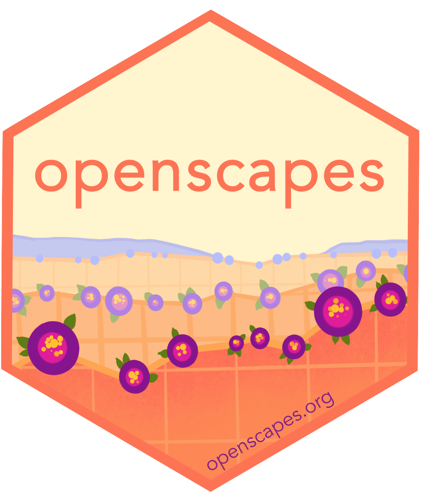{width="18%"}
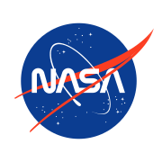{width="25%"}
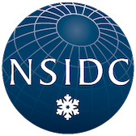{width="20%"}
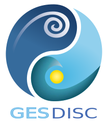{width="20%"}
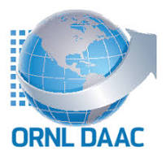{width="20%"}
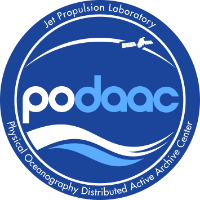{width="20%"}
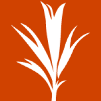{width="20%"}
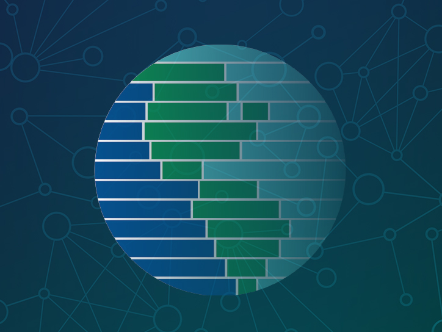{width="20%"}
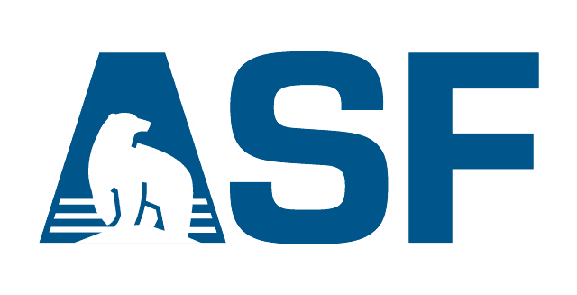{width="20%"}
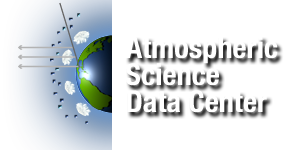{width="20%"}
{width="20%"}
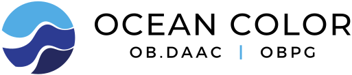{width="20%"}
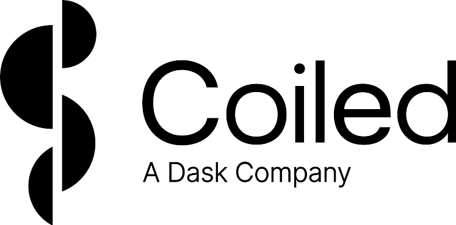{width="20%"}

[{width="18%"}](https://zulip.com)

